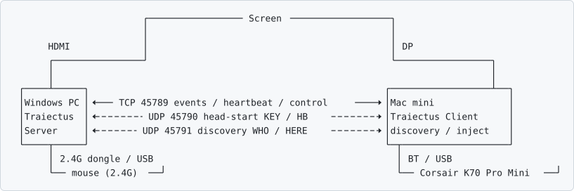

# Traiectus

**One keyboard, two computers. Press one key — keyboard, mouse and monitor all follow.**

[中文说明 →](README.md)

## Download (if you'd rather not build it yourself)

Grab the zip for your platform from **[Releases](https://github.com/BLEACHRukia/Traiectus/releases)**:

| Platform | File | What's inside |
|---|---|---|
| Windows | `Traiectus-Windows.zip` | `Traiectus.exe` (tray launcher) + `Traiectus-Server.exe` + config template + notes |
| macOS | `Traiectus-macOS.zip` | `Traiectus.app` + first-launch notes |

Both are **unsigned**: Windows shows a SmartScreen prompt (More info → Run anyway);
on macOS you must **right-click → Open** the first time (the notes inside the zip explain it).

To build from source instead, jump to Quick start below.

Traiectus is a small, self-hosted KVM for people who keep a Mac and a Windows PC on the same desk
and share **one keyboard, one mouse and one monitor** between them — without buying a hardware KVM switch.

It is not a virtual machine and not remote desktop. Both computers run normally and natively;
Traiectus just moves your *input devices* and *the monitor's input source* between them over your LAN.



Solid lines are TCP, dashed lines are UDP; neither UDP channel takes part in authentication.

## What it does

| Capability | What it means |
|---|---|
| **Mouse across machines** | The mouse stays plugged into Windows; its events are forwarded over the LAN to the Mac and injected with CGEvent. The mouse keeps working normally on Windows. |
| **One key switches everything** | When you switch the keyboard's host with its "to Windows" combo, Traiectus moves the **monitor input** and **mouse control** along with it. |
| **Head-start on the screen** | Windows watches the receiver's status frames read-only and switches the screen about **1.7 s earlier** than the Mac would notice the keyboard leaving (**Windows direction only**; going back to the Mac the two signals are near-simultaneous, so there is nothing to gain there). |
| **Sleep hand-off in one key** | Press one combo on the Mac (default ⌘1) to sleep it and hand the screen and mouse to Windows; waking it switches everything back automatically. |
| **Mouse-switch hotkey** | Switch just the mouse: press `⌃⌥M` (the same key as `Ctrl+Alt+M` on Windows) to move mouse control between the Mac and Windows, leaving the keyboard alone. Changeable in Settings → General. |
| **No IDs to look up** | The server auto-detects which mouse is yours; the keyboard is picked in Settings → Keyboard → My keyboard; the monitor's input numbers are "learned". |
| **No drivers, no hooks** | On Windows it only **reads** Raw Input: no interception, no system changes, no drivers, no kernel extensions. |

## Requirements (the caveats, upfront)

- **The keyboard must be able to switch hosts on its own** — i.e. it has a built-in `Fn` combo that
  switches between "Bluetooth host" and "2.4G / wired host". This project was tested with a
  **Corsair K70 Pro Mini** (Mac = Bluetooth BT1, Windows = SLIPSTREAM 2.4G receiver).
  Traiectus **cannot command the keyboard to switch hosts** — that is the keyboard firmware's job;
  it only *sees* the keyboard leave and makes the screen and mouse follow. With a keyboard that
  cannot switch hosts, "one key switches everything" does not hold.
- **A monitor with DDC/CI** (almost every modern monitor has it), with the two machines on
  different inputs.
- **Both machines on the same LAN**, able to reach each other.
- Tested on macOS 14+ / Windows 10-11. The Windows side is C++ (MinGW); the Mac side is Swift
  (SwiftUI + CGEvent + Network.framework).
- **The head-start (early screen switch) needs a keyboard with a vendor status-frame interface**
  (the tested K70 Pro Mini has one). With a keyboard that does not, everything else still works —
  you just lose the head-start in the Windows direction (~1.7 s slower).

## Typical usage (verified on real hardware)

```text
1. Both machines on → Windows server + bridge running → the Mac connects itself
2. On the Mac press the sleep hot key (default ⌘1)
       → the Mac sleeps, and in the same instant the monitor goes to DP and the mouse
         is handed to Windows (measured: 0.19 s)
3. The keyboard stays on the Mac's Bluetooth — deliberately: that's what wakes the Mac
4. To use Windows: press your keyboard's "switch to Windows" combo → screen and mouse follow
5. Back to the Mac: press the "back to Mac" combo → screen back to HDMI, mouse back to the Mac
6. Wake the Mac: press any key → it wakes, reconnects, and pulls screen + mouse back
```

Three things that are easy to get wrong (all measured):

| Observation | Who actually does it |
|---|---|
| Mac sleeps → screen goes to Windows | **Both**: the app switches on the "about to sleep" notification, **and** the monitor has its own input auto-detect |
| Mac sleeps → mouse usable on Windows | **The app** (sends `MODE Win` immediately). Without it you wait 4–5 s for the server to notice the client is gone |
| Keyboard switches host → screen follows | **The app.** The Fn combo doesn't change the HDMI signal, so the monitor can't know |
| Wake → screen returns to the Mac | **The app.** The monitor won't hop back from DP to HDMI by itself |

## Quick start

### 1. On Windows

```bat
:: windows\phase3-tcp\
build-mingw.bat                  :: build the server, Traiectus-Server.exe
start-server.bat                 :: start it (keep the window open)

:: That's all — nothing to fill in:
::   · no password: the first time a Mac connects, a confirm box appears on Windows — click Allow
::   · no mouse device id either: the server auto-detects the mouse you are actually using
::     (watch for a "DEVICE PICK ..." line in its log)
::   · the head-start (reading the keyboard receiver's status frames) is built into the server;
::     the old PowerShell bridge is no longer needed
```

For everyday use the tray launcher (`windows/launcher/`) is handier — it starts the server and
puts everything behind one tray icon (set mouse-switch hotkey / detect mouse / re-pair / quit):

```bat
cd windows\launcher
build-launcher.bat
copy config.example.ini config.ini    :: no need to edit it, just copy
Traiectus.exe
```

### 2. On the Mac

```bash
cd macos/kvm-link && ./build.sh         # 1) kvm-keywatch (keyboard-ownership watcher)
cd m1ddc && make                        # 2) m1ddc (monitor input switching, MIT)
cd ../../phase3-tcp && ./build.sh       # 3) Traiectus Client (bundles the two above into the .app)
./install-app.sh                        # 4) install to ~/Applications and launch at login
```

On first run, tick Traiectus under **System Settings → Privacy & Security → Accessibility**
(it needs that to inject events); macOS also asks once for "local network access" the first time
you connect to a LAN address.

**No address to type**: the Mac is the connecting side and finds Windows on the LAN by itself.
**No password either**: on the first connection a confirm box appears on Windows — click Allow,
and the password is generated and remembered on both sides. (Lost it / changed machine?
Tray → "Re-pair".)

### 3. Monitor input source numbers

DDC/CI input numbers differ from monitor to monitor (measured here: `17` = HDMI-1, `15` = DP-1) —
**no need to dig out the manual**: Settings → **Display** → click "Start learning", then follow the
prompt and press the button on the monitor once; the app reads and remembers it.
By hand works too: `m1ddc get input` reads the current value, then write it into the Mac-side
config file.

## Configuration

Everything Mac-side that depends on *your* hardware lives in a config file — no code edits, no
rebuilds:

| File | What's in it |
|---|---|
| [`config.example.json`](config.example.json) | Template: monitor input numbers, keyboard vendor ID, external tool paths, default address |
| `windows/launcher/config.example.ini` | Windows tray template: server args, hotkey, port (`--device` empty = auto-detect the mouse) |
| `windows/phase3-tcp/paired.json` | The pairing token, stored on each side (**never commit it** — already in `.gitignore`) |

## Documentation

| Doc | What's in it |
|---|---|
| [`PROTOCOL.md`](PROTOCOL.md) | The wire protocol between the two sides (ports, handshake, message format) — the authoritative definition |
| [`docs/TROUBLESHOOTING.md`](docs/TROUBLESHOOTING.md) | Known traps and the order to check them in (**read this first if it won't connect**) |
| [`docs/ARCHITECTURE.md`](docs/ARCHITECTURE.md) | Architecture and the reasoning behind each mechanism |
| [`docs/TESTING.md`](docs/TESTING.md) | How to run the three layers of tests |
| [`docs/design/`](docs/design) | Design notes (e.g. "keyboard status-frame detection and verification") |
| [`docs/devlog/`](docs/devlog) | Development log: K70 reverse engineering, status-frame analysis, measured data |
| [`macos/phase3-tcp/README.md`](macos/phase3-tcp/README.md) | Mac client engineering details |
| [`windows/phase3-tcp/`](windows/phase3-tcp) | Windows server engineering details |

Some of these are still written in Chinese only — English versions are on the way, starting with
the protocol and troubleshooting docs.

## Status

A personal project: **made to work on one specific hardware combination, and used daily**
(the process and the measurements live in `docs/devlog/`). It is not general-purpose software —

- "one key switches everything" depends on a specific keyboard firmware (see Requirements above)
- the monitor's input numbers have to be "learned" once for your own monitor (the keyboard and
  mouse are already detected automatically)
- it has only been verified on macOS + Windows

If you happen to have exactly this setup — a Mac and a Windows PC sharing one keyboard, mouse and
monitor — this saves you a hardware KVM.

## License

MIT — see [`LICENSE`](LICENSE). Third-party components and trademark notices:
[`THIRD_PARTY_NOTICES.md`](THIRD_PARTY_NOTICES.md).
