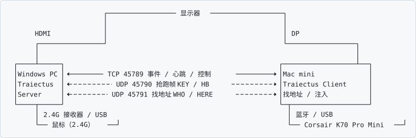

# Traiectus

**一把键盘，两台电脑。按一次键，键盘、鼠标、显示器一起跟着走。**

[English →](README.en.md)

## 下载（不想自己编译就用这个）

到 **[Releases](https://github.com/BLEACHRukia/Traiectus/releases)** 下对应平台那个 zip：

| 平台 | 文件 | 里面是什么 |
|---|---|---|
| Windows | `Traiectus-Windows.zip` | `Traiectus.exe`（托盘入口）+ `Traiectus-Server.exe` + 配置模板 + 说明 |
| macOS | `Traiectus-macOS.zip` | `Traiectus.app` + 首次打开说明 |

两个都是未签名包：Windows 会弹 SmartScreen（点「更多信息 → 仍要运行」）；
macOS 第一次要**右键 →「打开」**（zip 里那份说明写得更细）。

想自己编译（或改了代码）就往下看「快速开始」。

Traiectus 是一个自用的小型 KVM：给"桌上同时有 Mac 和 Windows、共用一把键盘一只鼠标一台显示器"
的人用，**不用买硬件 KVM 切换器**。

它不是虚拟机、不是远程桌面 —— 两台电脑都原生正常运行，Traiectus 只是把**输入设备**和
**显示器的输入源**在它们之间搬来搬去。



图里实线是 TCP、虚线是 UDP；两条 UDP 都不参与鉴权。

## 能做什么

| 能力 | 说明 |
|---|---|
| **鼠标跨机** | 鼠标插在 Windows 上，事件经局域网转发到 Mac，用 CGEvent 注入。Windows 本地鼠标照常可用。 |
| **一次按键全切** | 按键盘上"切到 Windows"的快捷键换主机时，显示器输入源和鼠标控制权一起跟着切。 |
| **预先切屏（抢跑）** | Windows 侧只读监听接收器的状态帧，比 Mac 侧自己发现键盘离开**早约 1.7 秒**切屏（**只对"去 Windows"方向**；"回 Mac"方向两个信号几乎同时，本来就没有提前量）。 |
| **睡眠一键交接** | 在 Mac 上按一个组合键（默认 ⌘1）让 Mac 睡眠，同时把屏幕和鼠标交给 Windows；唤醒后自动切回。 |
| **鼠标切换热键** | 单独切鼠标：按一下 `⌃⌥M`（和 Windows 侧的 `Ctrl+Alt+M` 是同一个键）在 Mac / Windows 之间换鼠标控制权，键盘不动。可在「设置 → 通用」里改。 |
| **不用查任何 ID** | 鼠标是哪只由服务端自动识别；键盘是哪把在「设置 → 键盘 → 我的键盘」点一下就能选；显示器输入源编号是"学"出来的 —— 都不用翻说明书、不用抄设备串。 |
| **不装驱动、不 hook** | Windows 侧**只读捕获** Raw Input：不拦截、不改系统设置、不装驱动、不用内核扩展。 |

## 前提（先说清楚）

- **键盘必须能在两台机器之间换主机** —— 也就是内置 `Fn` 组合键在"蓝牙主机"和"2.4G / 有线主机"
  之间切换的键盘。本项目实测的是 **Corsair K70 Pro Mini**（Mac = 蓝牙 BT1，Windows = SLIPSTREAM 2.4G 接收器）。
  Traiectus **不能命令键盘换主机** —— 那是键盘固件的事；它只是"看见"键盘走了，然后让屏幕和鼠标跟着走。
- **显示器支持 DDC/CI**，且两台机器接在不同输入口上。
- **两台机器在同一个局域网**里。
- 实测环境 macOS 14+ / Windows 10-11。Windows 侧 C++（MinGW），Mac 侧 Swift。
- **抢跑（提前切屏）需要键盘有厂商状态帧接口**（实测的那把 Corsair K70 Pro Mini 有）。
  换一把没有这个接口的键盘，一切照常工作，只是"去 Windows"那个方向没有提前量、慢约 1.7 秒 ——
  而"键盘是哪把"这件事可以在「设置 → 键盘 → 我的键盘」里点一下换掉。

## 典型使用流程（真机实测过）

```text
1. 两边开机 → Windows 端服务端起来（抢跑读帧也在服务端里）→ Mac 端自动连上，鼠标控制权同步回 Mac
2. 在 Mac 上按睡眠快捷键（默认 ⌘1）
       → Mac 睡眠，同一瞬间屏幕切到 DP、鼠标控制权交给 Windows（实测 0.19 秒）
3. 键盘仍留在 Mac 的蓝牙上 —— 这是刻意的：唤醒 Mac 靠的就是键盘
4. 要去 Windows：按键盘上切到 Windows 的快捷键 → 键盘去 2.4G → 屏幕与鼠标跟着切
5. 要回 Mac：   按键盘上切回 Mac 的快捷键 → 键盘回蓝牙 → 屏幕切回 HDMI、鼠标回 Mac
6. 唤醒 Mac：按键盘任意键 → Mac 醒来 → 自动重连 → 自动切回 HDMI + 鼠标回 Mac
```

三件容易搞错的事（都实测确认过）：

| 现象 | 到底是谁做的 |
|---|---|
| Mac 睡下去 → 画面到 Windows | **两条路都在**：软件在收到「即将睡眠」通知时主动切一次；显示器自身也有输入源自动检测 |
| Mac 睡下去 → 鼠标能在 Windows 上用 | **软件**（`willSleep` 时立刻发 `MODE Win`）。不发要等服务端发现客户端掉线，卡 4~5 秒 |
| 键盘换主机 → 屏幕跟着切 | **软件**。Fn 组合键不改变 HDMI 信号，显示器无从知道 |
| 唤醒 → 画面回到 Mac | **软件**。显示器不会自己从 DP 跳回 HDMI |

## 快速开始

### 1. Windows 侧

```bat
:: windows\phase3-tcp\
build-mingw.bat                  :: 编译服务端 Traiectus-Server.exe
start-server.bat                 :: 启动服务端（窗口别关）

:: 就这些，没有要填的东西：
::   · 没有口令 —— 第一次 Mac 连过来时，Windows 上会弹一个确认框，点「允许」即可
::   · 鼠标设备串也不用填 —— 服务端会自动识别你正在用的那只（日志里会出现 DEVICE PICK ...）
::   · 抢跑（读键盘接收器的状态帧）已经做在服务端里，不再需要单独起 PowerShell 桥接
```

日常用托盘的统一入口（`windows/launcher/`）更省事 —— 一键拉起服务端，托盘右键就有
「设置鼠标切换快捷键…」「检测鼠标…」「重新配对」「退出」：

```bat
cd windows\launcher
build-launcher.bat
copy config.example.ini config.ini     :: 不用改内容，直接复制就行
Traiectus.exe                          :: 托盘出现圆点，绿 = 运行中
```

### 2. Mac 侧

```bash
cd macos/kvm-link && ./build.sh         # 1) kvm-keywatch（键盘归属监听）
cd m1ddc && make                        # 2) m1ddc（显示器输入源切换，MIT）
cd ../../phase3-tcp && ./build.sh       # 3) Traiectus Client（会把上面两个打进 .app）
./install-app.sh                        # 4) 装到 ~/Applications 并设为登录启动
```

首次运行要在 **系统设置 → 隐私与安全性 → 辅助功能** 里给 Traiectus 打勾（注入事件需要它）；
连内网地址时 macOS 还会问一次"允许访问本地网络"。

**地址不用填**：Mac 是主动连的一侧，找不到 Windows 时会自己在局域网里找（广播问一声 + 扫本网段）。
**也没有口令**：第一次连接时 Windows 上弹确认框，点「允许」→ 口令自动生成、两端各自记住，
两台机器都不用打字。之后想换设备或口令丢了，用 Windows 托盘右键 →「重新配对」。

### 3. 显示器输入源编号

DDC/CI 的输入源编号因显示器而异（本机实测：`17` = HDMI-1，`15` = DP-1），**不用翻说明书**：

设置 → **显示** → 点「开始学习」，按提示用显示器上的按钮切一次就行 ——
程序先读 Mac 那一侧的编号，再让你切到 Windows 那边读第二个，自动记住。

手动也行：`m1ddc get input` 读当前值，再写进
[`config.example.json`](config.example.json) → `~/Library/Application Support/Traiectus/config.json`。

## 配置

Mac 侧所有跟"你的硬件"有关的参数都在配置文件里，不用改代码重编：

| 文件 | 内容 |
|---|---|
| [`config.example.json`](config.example.json) | 模板：显示器输入源号、键盘厂商 ID、外部工具路径、默认地址 |
| `windows/launcher/config.example.ini` | Windows 托盘模板：服务端参数、热键、端口（`--device` 默认留空 = 自动识别鼠标） |
| `windows/phase3-tcp/paired.json` | 配对生成的口令，两端各自保存（**不要提交**，已在 `.gitignore` 里） |

## 文档

| 文档 | 内容 |
|---|---|
| [`PROTOCOL.md`](PROTOCOL.md) | 两端通信协议（端口、握手、报文格式）—— 权威定义 |
| [`docs/TROUBLESHOOTING.md`](docs/TROUBLESHOOTING.md) | 已知坑与排查顺序（**连不上先看这个**） |
| [`docs/ARCHITECTURE.md`](docs/ARCHITECTURE.md) | 各机制为什么这么设计 |
| [`docs/TESTING.md`](docs/TESTING.md) | 验证方案：三层测试怎么跑（**改判定逻辑前先看**） |
| [`docs/design/`](docs/design) | 设计方案（例如"键盘状态帧检测与验证"） |
| [`docs/devlog/`](docs/devlog) | 开发过程：K70 键盘逆向、状态帧分析、实测数据 |
| [`macos/phase3-tcp/README.md`](macos/phase3-tcp/README.md) | Mac 客户端工程细节 |
| [`windows/phase3-tcp/`](windows/phase3-tcp) | Windows 服务端工程细节 |

## 状态与边界

个人项目：**在一台具体的机器组合上做到能用，并长期实际使用**（过程与实测数据都在 `docs/devlog/`）。
它不是通用软件：

- "一次按键全切"依赖特定键盘固件（见上面"前提"）
- 显示器输入源编号要按你自己的显示器"学"一次（键盘是哪把、鼠标是哪只都已经能自动认）
- 只在 macOS + Windows 这一种组合上验证过
- 安全约定：不影响 Windows 正常鼠标输入、不装驱动、不用内核扩展、不改系统设置、退出后一切恢复原样

如果你正好是"Mac + Windows 共用一个键鼠和一台显示器"的场景，这套东西能直接省掉一个硬件 KVM。

## 许可

MIT，见 [`LICENSE`](LICENSE)。第三方组件与商标声明见 [`THIRD_PARTY_NOTICES.md`](THIRD_PARTY_NOTICES.md)。
